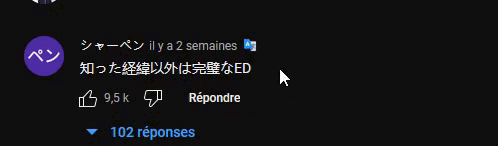
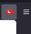
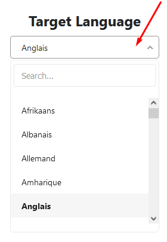

<h1 align="center">RedNote-Comment-Translate</h1>
<h3 align="center">(Firefox and Chrome)</h3>

The project is copy from https://github.com/BlanCow/YouTube-Comment-Translate for Youtube.
<!-- 

	  
		<a href="https://addons.mozilla.org/en-US/firefox/addon/youtube-comment-translate/">
			
		<a href="https://chromewebstore.google.com/detail/youtube-comment-translate/inkldemkdmcdgjdjgbimjkfafpgibaha">
			
	  

 -->

<!-- vim-markdown-toc GFM -->

- [Usage](#usage)
  - [Changing the language](#changing-the-language)
- [Installation](#installation)
- [Build](#build)

<!-- vim-markdown-toc -->

## Usage

After installing, this icon will appear next to every comment 

### Changing the language

The default target language is your browser language. To change it, click in the top right corner of firefox on the extension icon:

and select a new target language by clicking on the dropdown:

The changes are applied instantly so no need to refresh the youtube page

## Installation

Simply download the extension from
https://addons.mozilla.org/en-US/firefox/addon/youtube-comment-translate/ for Firefox
or from
https://chromewebstore.google.com/detail/youtube-comment-translate/inkldemkdmcdgjdjgbimjkfafpgibaha for Chrome.

## Build

For developers who want to fork my project, after making a change, you must build the extension for the browser of your choice (currently only firefox and chrome) with the following command:
`powershell ./build-extension.ps1 {{ BROWSER_NAME }}` (Windows 10+ is required)

The command minifies inject.js, create a different manifest.json file depending on the browser and generates a zip file and folder containing the extension data that you can upload to the browser.
